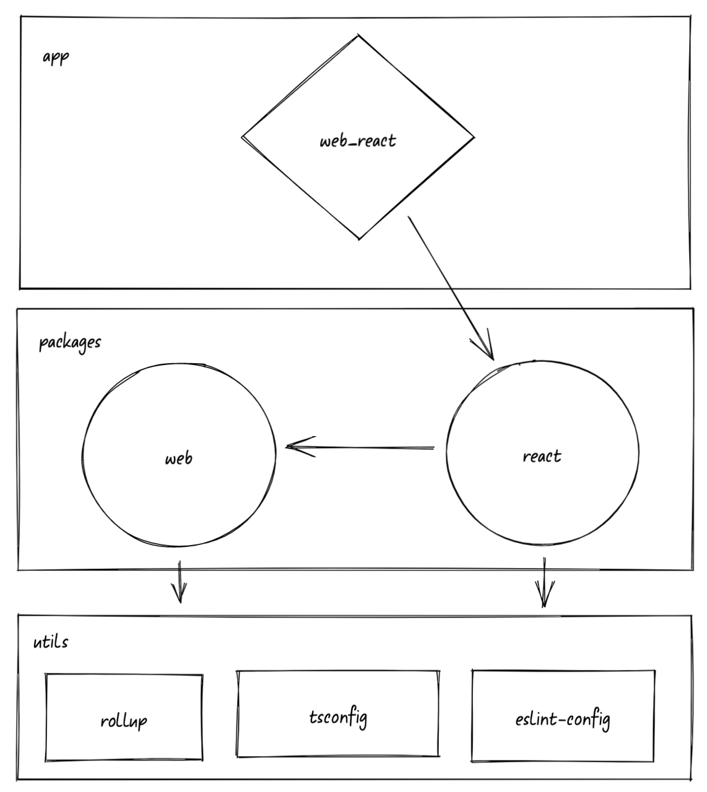
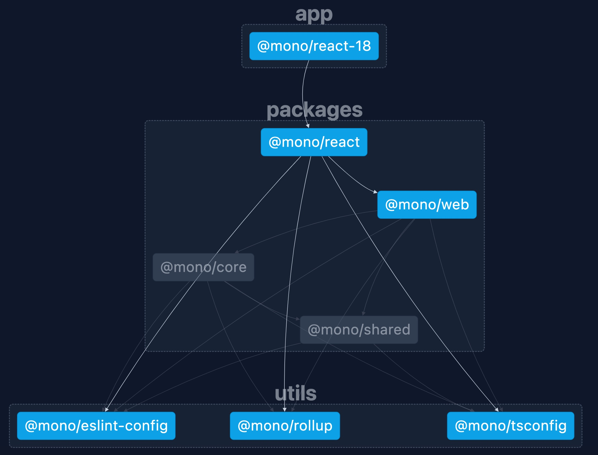

# overview
based on Pnpm + nx + biome,example for monorepo and the dependence graph as follows:

## install
1. install [**vscode biome extension**](https://marketplace.visualstudio.com/items?itemName=biomejs.biome)
2. requires at least `Node 18.18.0` and `Pnpm 8`
3. run `pnpm i` to install dependencies

## build
build all of sub projects in parallel.

`pnpm build`

## run web
run app/react-18 in dev:

`pnpm run web:dev`

## watch
use watch with [**nx**](https://nx.dev/recipes/running-tasks/workspace-watching#workspace-watching), commmand would be like

 `nx watch --all -- nx run \$NX_PROJECT_NAME:build`
 
 eg: `nx watch --projects=@mono/react --includeDependentProjects -- nx run @mono/react:esm`

## graph
run `nx graph`,you'll see graph like as follows:

