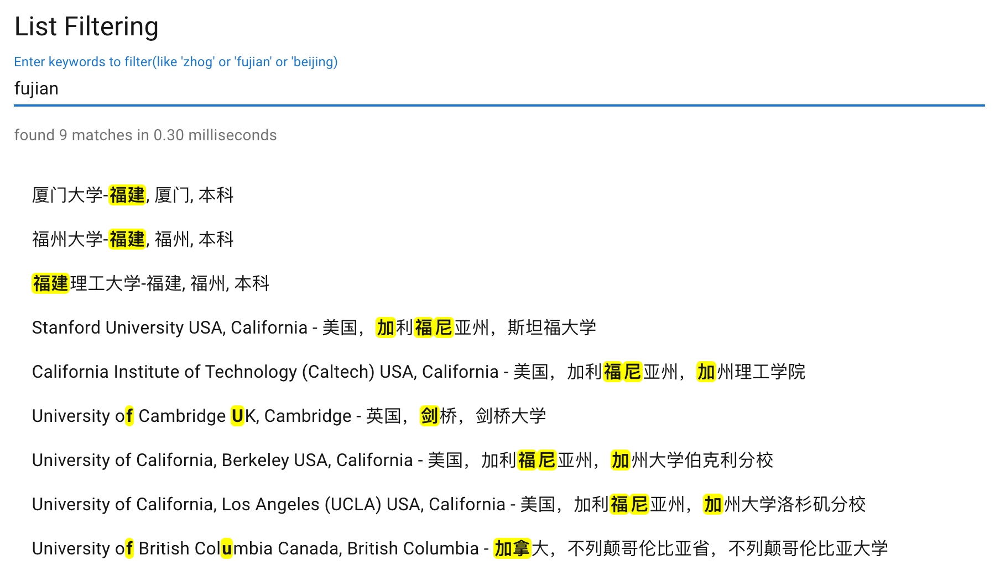

<div align="center">
    <h2>Text Search Engine</h2>
    <p>A text search engine that supports mixed Chinese and English fuzzy search</p>
</div>

# Overview
[中文 README](./docs/README_zh.md)

A dynamic programming-based text search engine that supports mixed Chinese and English fuzzy search, returning the highest-weight matching results.
## Who use it?
* [Blazwitcher: A Chrome Extension For Searching and Switcher in Blazing Speed](https://chromewebstore.google.com/detail/blazwitcher-search-and-sw/fjgablnemienkegdnbihhemebmmonihg)

# Online Demo
Check out this [online demo](https://cjinhuo.github.io/text-search-engine/) if you are interested.



# Installation
```bash
npm i text-search-engine
```
## Supported Environments
Supports both `Node.js` and `Web` environments.

# Usage
## search
### Pure English Search
```javascript
import { search } from 'text-search-engine'

const source = 'nonode'

search(source, 'no') //[[0, 1]]
// Matches 'no', continuous characters have higher weight
search(source, 'nod') // [[2, 4]]
search(source, 'noe') // [[0, 1], [5, 5]]
search(source, 'oo') // [[1, 1],[3, 3]]
```
`search('nonode', 'noe')` Match result: <mark>no</mark>nod<mark>e</mark>

### Pure Chinese Search
```javascript
import { search } from 'text-search-engine'

const source = '地表最强前端监控平台'

search(source, 'jk') // [[6, 7]]
search(source, 'qianduapt') // [[4, 5],[8, 9]]
```
`search('地表最强前端监控平台', 'qianduapt')` Match result: 地表最强<mark>前端</mark>监控<mark>平台</mark>

### Mixed Chinese and English Search
```javascript
import { search } from 'text-search-engine'

search('Node.js 最强监控平台 V9', 'nodejk') //[[0, 3],[10, 11]]

const source_2 = 'a_nd你你的就是我的'
search(source_2, 'nd') //[[2, 3]]
// Matches '你你的'
search(source_2, 'nnd') //[[4, 6]]
// Matches 'a_'n'd你你的就'是我的'
search(source_2, 'nshwode') //[[2, 2],[8, 10]]
```
`search('Node.js 最强监控平台 V9', 'nodejk')` Match result: <mark>Node</mark>.js 最强<mark>监控</mark>平台 V9

### Space-separated Search
Adding spaces makes each term independent. Each term starts matching from the beginning, and matched terms will be removed, so the next term starts matching from the beginning and ignores previously matched terms.

```javascript
const source_1 = 'Node.js 最强监控平台 V9'

search(source_1, 'jknode') // undefined
search(source_1, 'jk node') // [[10, 11],[0, 3]]
```
`search('Node.js 最强监控平台 V9', 'jk node')` Match result: <mark>Node</mark>.js 最强<mark>监控</mark>平台 V9

### Sort of Backtracking
```javascript
const source_1 = 'zxhxo zhx'
search(source_1, 'zh') //[[6, 7]])
// Even though the weight of 'zh' is higher, but the next term 'o' is not matched, so hit the previous one
search(source_1, 'zho') //[[0, 0],[2, 2],[4, 4]])
```

## highlightMatches
This API is used for quickly validating text match highlights. It returns ANSI escape codes that can be output using console.log in both Web and Node.js environments to see the highlighted text.
```javascript
import { highlightMatches } from 'text-search-engine'
console.log(highlightMatches('Node.js 最强监控平台 V9', 'nodev9'))
```
The console will output: <mark>Node</mark>.js 最强监控平台 <mark>V9</mark>

## options
### mergeSpaces
Default: `false`
```javascript
const source = 'chrome 应用商店'
search(source, 'meyinyon') //[[4, 5], [7, 8]])
// would merge blank spaces between each index of the matched term
search(source, 'meyinyon', { mergeSpaces: true }) //[[4, 8]])
```

### strictnessCoefficient
Default: `undefined`
```javascript
const source = 'Node.js 最强监控平台 V8'
search(source, 'nozjk') //[[0, 1], [8, 8], [10, 11]]
// When the strictnessCoefficient is 0.5 and nozjk is five characters long, Math.ceil(5 * 0.5) equals 3. If the match is less than or equal to 3 characters, it will return normally.
search(source, 'nozjk', { strictnessCoefficient: 0.5 }) //[[0, 1], [8, 8], [10, 11]]
search(source, 'nozjk', { strictnessCoefficient: 0.4 }) //undefined
```

## React Component
Take a look at [CodeSandbox Online Demo](https://codesandbox.io/p/sandbox/text-search-engine-component-22c5m5?file=%2Fsrc%2FApp.tsx%3A8%2C12)
### HighlightWithTarget
```javascript
import { HighlightWithTarget } from 'text-search-engine/react'

function Test() {
    return <HighlightWithTarget source='Node.js 最强监控平台 V9' target='nodejk' />
}
```

### HighlightWithRange
```javascript
import { HighlightWithRanges } from 'text-search-engine/react'
import { search } from 'text-search-engine'

export default function DemoForHighlightWithTarget() {
	const ranges = search('Node.js 最强监控平台 V9', 'nodejk')
	return <HighlightWithRanges source='Node.js 最强监控平台 V9' hitRanges={ranges}  />
}
```


# Performance
|       | Time Complexity          | Space Complexity         |
| ----- | ------------------------ | ------------------------ |
| Best  | O(M(source))             | O(M(source))             |
| Worst | O(M(source) * N(target)) | O(M(source) * N(target)) |


# 📞 contact
welcome to raise issue, you can contact me on wx or email if you have some good suggestion(notes: text-search-engine)
* wx：cjinhuo
* email: cjinhuo@qq.com