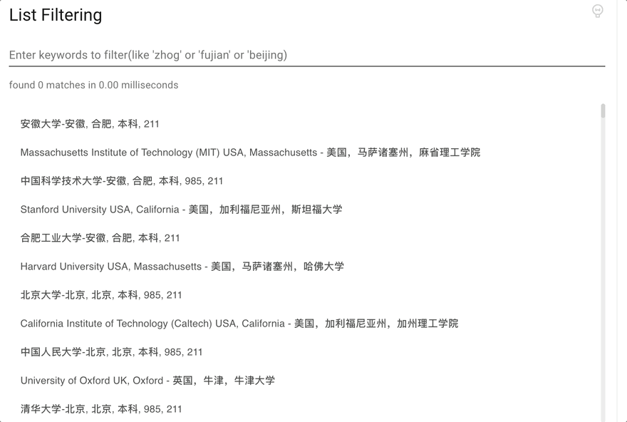

<div align="center">
    <h2>Text Search Engine</h2>    

[](https://www.npmjs.com/package/text-search-engine)
[](https://github.com/cjinhuo/text-search-engine/commits/master)
[](http://npm-stat.com/charts.html?package=cjinhuo/text-search-engine)
[](https://github.com/cjinhuo/text-search-engine/blob/dev/LICENSE)
<p>支持中英文混合的模糊搜索引擎</p>
</div>

# 概览
[English README](../README.md)

基于动态规划的文本搜索引擎，支持中英文混合模糊搜索，并返回权重值最高的匹配结果。

## 谁在使用？
* [Blazwitcher: 一个光速搜索和切换标签，书签和历史的浏览器插件](https://chromewebstore.google.com/detail/blazwitcher-search-and-sw/fjgablnemienkegdnbihhemebmmonihg)

# 在线示例
可以进[线上示例](https://cjinhuo.github.io/text-search-engine/)试试搜索高亮的效果。



## 算法可视化
搜索引擎使用动态规划算法来寻找最优匹配路径。以下是算法工作原理的可视化演示：


该可视化展示了算法如何构建矩阵来计算搜索查询与目标文本之间的最优匹配分数，突出显示产生最佳匹配结果的路径。

你也可以访问[在线可视化演示](https://cjinhuo.github.io/text-search-engine/visual)来交互式地体验算法的工作过程。

# 安装
```bash
npm i text-search-engine
```
## 支持环境
支持 `Node.js` 和 `Web` 环境。


# 使用
## search
### 纯英文搜索
```javascript
import { search } from 'text-search-engine'

const source = 'nonode'

search(source, 'no') //[[0, 1]]
// 匹配到 nod，连续文字的的权重值更高
search(source, 'nod') // [[2, 4]]
search(source, 'oo') // [[1, 1],[3, 3]]
```
`search('nonode', 'noe')` 匹配结果: <mark>no</mark>nod<mark>e</mark>

### 纯中文搜索
```javascript
import { search } from 'text-search-engine'

const source = '地表最强前端监控平台'

search(source, 'jk') // [[6, 7]]
search(source, 'qianduapt') // [[4, 5],[8, 9]]
```
`search('地表最强前端监控平台', 'qianduapt')` 匹配结果：地表最强<mark>前端</mark>监控<mark>平台</mark>


### 中英文混合搜索
```javascript
import { search } from 'text-search-engine'

search('Node.js 最强监控平台 V9', 'nodejk') //[[0, 3],[10, 11]]

const source_2 = 'a_nd你你的就是我的'
search(source_2, 'nd') //[[2, 3]]
// 匹配到 你你的
search(source_2, 'nnd') //[[4, 6]]
// 匹配到 a_'n'd你你的就'是我的'
search(source_2, 'nshwode') //[[2, 2],[8, 10]]
```
`search('Node.js 最强监控平台 V9', 'nodejk')` 匹配结果：<mark>Node</mark>.js 最强<mark>监控</mark>平台 V9


### 空格分词搜索
加空格后，每个词都是独立的，都会从头开始匹配，已匹配到的词会被移除，下次从头匹配时会忽略已匹配到的词

```javascript
const source_1 = 'Node.js 最强监控平台 V9'

search(source_1, 'jknode') // undefined
search(source_1, 'jk node') // [[10, 11],[0, 3]]
```
`search('Node.js 最强监控平台 V9', 'jk node')` 匹配结果：<mark>Node</mark>.js 最强<mark>监控</mark>平台 V9

### 类回溯
```javascript
const source_1 = 'zxhxo zhx'
search(source_1, 'zh') //[[6, 7]])
// 虽然连续的 'zh' 权重比较高，但后面的 'o' 没有匹配到字符，所以取前面
search(source_1, 'zho') //[[0, 0],[2, 2],[4, 4]])
```

## highlightMatches
这个 API 用于快速验证文本匹配高亮结果，返回 ANSI 转义符，在 Web 和 Node.js 中用 console.log 输出即可看到高亮文字。
```javascript
import { highlightMatches } from 'text-search-engine'
console.log(highlightMatches('Node.js 最强监控平台 V9', 'nodev9'))
```
控制台将输出：<mark>Node</mark>.js 最强监控平台 <mark>V9</mark>

## options

| 选项名称                | 默认值      | 描述 & 例子                                                                                                                                                                                                                                                                                                                                                                                                                                              |
| ----------------------- | ----------- | -------------------------------------------------------------------------------------------------------------------------------------------------------------------------------------------------------------------------------------------------------------------------------------------------------------------------------------------------------------------------------------------------------------------------------------------------------- |
| `mergeSpaces`           | `true`      | 是否合并匹配项之间的空格。当设置为 true 时，会将匹配结果中间的空格合并为连续的索引范围。<br /><br />`search('chrome 应用商店', 'meyinyon',{ mergeSpaces: false })` 返回 `[[4, 5], [7, 8]]`<br/><br/>`search('chrome 应用商店', 'meyinyon', { mergeSpaces: true })` 返回 `[[4, 8]]`                                                                                                                                                                       |
| `strictnessCoefficient` | `undefined` | 严格系数，用于控制匹配的严格程度。当设置为数值时，如果匹配的字符数小于等于 `Math.ceil(查询长度 * 系数)`，则返回结果，否则返回 undefined。<br /><br />`search('Node.js 最强监控平台 V8', 'nozjk')` 返回 `[[0, 1], [8, 8], [10, 11]]`<br/>`search('Node.js 最强监控平台 V8', 'nozjk', { strictnessCoefficient: 0.5 })` 返回 `[[0, 1], [8, 8], [10, 11]]`<br/>`search('Node.js 最强监控平台 V8', 'nozjk', { strictnessCoefficient: 0.4 })` 返回 `undefined` |
| `isCharConsecutive`     | `false`     | 控制匹配的字符是否需要在源字符串中连续。当设置为 true 时，要求匹配的字符在源字符串中连续（中文和英文不需要连续）。<br /><br />`search('Chinese@中国 People-人', 'chie')` 返回 `[[0, 2], [4, 4]]`<br/>`search('Chinese@中国 People-人', 'chie', { isCharConsecutive: true })` 返回 `undefined`<br/>`search('Chinese@中国 People-人', '中ple', { isCharConsecutive: true })` 返回 `[[8, 8], [14, 16]]`                                                     |
| `strictCase`            | `false`     | 控制大小写敏感匹配。当设置为 true 时，搜索将匹配确切的大小写。当设置为 false 时，搜索将不区分大小写。<br /><br />`search('Hello World', 'hello')` 返回 `[[0, 4]]`<br/>`search('Hello World', 'hello', { strictCase: true })` 返回 `undefined`<br/>`search('Hello World', 'hello', { strictCase: false })` 返回 `[[0, 4]]`                                                                                                                                |


## React Component
查看 [CodeSandbox 在线示例](https://codesandbox.io/p/sandbox/text-search-engine-component-22c5m5?file=%2Fsrc%2FApp.tsx%3A8%2C12)

### HighlightWithTarget
```javascript
import { HighlightWithTarget } from 'text-search-engine/react'

function Test() {
    return <HighlightWithTarget source='Node.js 最强监控平台 V9' target='nodejk' />
}
```

### HighlightWithRange
```javascript
import { HighlightWithRanges } from 'text-search-engine/react'
import { search } from 'text-search-engine'

export default function DemoForHighlightWithTarget() {
	const ranges = search('Node.js 最强监控平台 V9', 'nodejk')
	return <HighlightWithRanges source='Node.js 最强监控平台 V9' hitRanges={ranges}  />
}
```


# 性能
|      | 时间复杂度               | 空间复杂度               |
| ---- | ------------------------ | ------------------------ |
| 最优 | O(M(source))             | O(M(source))             |
| 最坏 | O(M(source) * N(target)) | O(M(source) * N(target)) |


# Contributing
请参考 [贡献指南](./CONTRIBUTING.md) 了解更多信息，感谢所有贡献者 [contributors](https://github.com/cjinhuo/text-search-engine/graphs/contributors) ❤️

[](https://github.com/cjinhuo/text-search-engine/graphs/contributors)

[](https://api.star-history.com/svg?repos=cjinhuo/text-search-engine&type=Date)

# 📞 联系
欢迎提 issue，你可以加我微信或者邮件联系我，如果你有好的建议(备注：text-search-engine)
* wx：cjinhuo
* email: cjinhuo@qq.com
